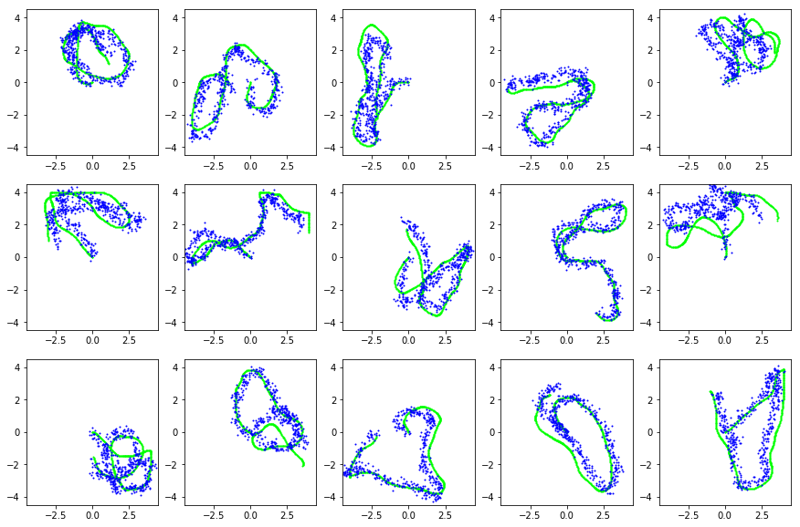
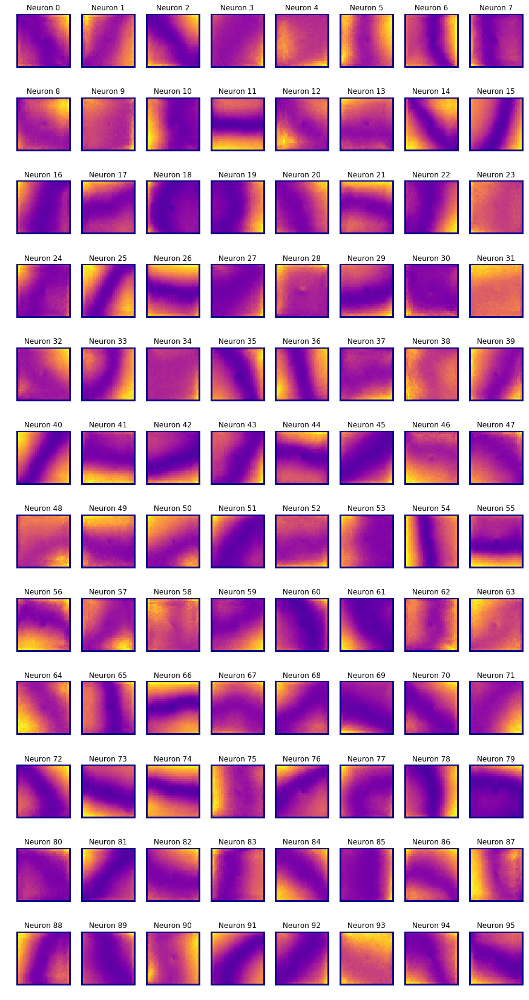
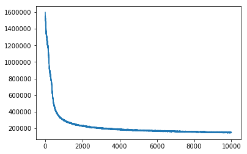

# rat-rnn
Simulate Rat neural activity in the maze

Attempt to re-produce results from [ICLR2018: EMERGENCE OF GRID-LIKE REPRESENTATIONS BY TRAINING RECURRENT NEURAL NETWORKS TO PERFORM SPATIAL LOCALIZATION](https://openreview.net/pdf?id=B17JTOe0-) paper.

Results so far. Training with LSTM or CTRNN gives comparable results.

Below are LSTM results after training for 10000 iterations on 1 millions sampless:
* Rat did learn spatial localization (dead reckoning) task well
* Rat performs well under significant noise injected into the network
* However NO grid cells formed in the process :(

